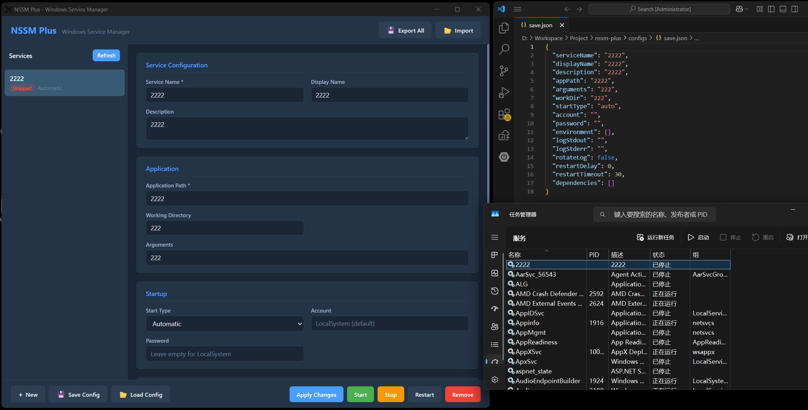

# NSSM Plus

一个基于 Go + Wails (WebView2) 的 Windows 服务管理工具，是 NSSM (Non-Sucking Service Manager) 的现代化替代方案。提供原生 GUI 界面，无需命令行操作，支持配置导入/导出和一站式服务管理。

# Author
```
-------------------------------------
- 🚀 Powered by Moshow郑锴
- 🌟 Might the holy code be with you!
-------------------------------------
🔍 公众号 👉 软件开发大百科
💻 CSDN 👉 https://zhengkai.blog.csdn.net
📂 GitHub 👉 https://github.com/moshowgame
```

# Introduction

## 界面预览



## 功能特性

- **原生 GUI** - 直接双击打开，无需命令行启动
- **单页面操作** - 左侧服务列表 + 右侧配置表单，无 Tab 切换
- **完整服务管理** - 安装、修改、启动、停止、重启、删除服务
- **配置导入/导出** - 单个/批量配置保存为 JSON 文件，跨机器迁移
- **服务状态监控** - 实时显示 Running / Stopped 等状态
- **暗色主题** - 现代化深色 UI

## 技术栈

| 层级 | 技术 | 版本 |
|------|------|------|
| 桌面框架 | [Wails](https://wails.io/) (WebView2) | v2.12 |
| 后端 | Go | 1.22+ |
| 前端 | Vue 3 + Vite 5 | ^3.4 / ^5.4 |
| Windows API | `golang.org/x/sys/windows/svc/mgr` | - |

## 项目结构

```
nssm-plus/
├── main.go                       # Wails 入口，窗口配置、资源嵌入
├── app.go                        # 前后端桥接层，暴露给前端的 Go 方法
├── go.mod / go.sum               # Go 模块依赖
├── wails.json                    # Wails 项目配置
│
├── internal/                     # 后端核心逻辑（不直接暴露给前端）
│   ├── service/
│   │   └── manager.go            # Windows SCM 服务管理（安装/删除/启停/查询/修改）
│   └── config/
│       └── config.go             # 配置文件序列化（JSON 导入/导出）
│
├── frontend/                     # 前端源码
│   ├── index.html                # HTML 入口
│   ├── package.json              # npm 依赖
│   ├── vite.config.js            # Vite 构建配置
│   ├── tsconfig.json             # TypeScript 配置
│   └── src/
│       ├── main.js               # Vue 应用挂载
│       ├── style.css             # 全局样式 + CSS 变量（暗色主题）
│       └── App.vue               # 唯一的 Vue 组件（全部 UI 逻辑）
│
├── build/
│   └── appicon.png               # 应用图标
│
├── configs/
│   └── example.json              # 示例服务配置文件
│
└── .gitignore
```

## 架构设计

```
┌─────────────────────────────────────────────────────┐
│                   WebView2 窗口                       │
│  ┌─────────────────────────────────────────────────┐ │
│  │              Vue 3 前端 (App.vue)                │ │
│  │  ┌──────────┐  ┌────────────┐  ┌──────────────┐  │ │
│  │  │ 服务列表  │  │ 配置表单    │  │  操作按钮栏   │  │ │
│  │  └────┬─────┘  └─────┬──────┘  └──────┬───────┘  │ │
│  └───────┼──────────────┼───────────────┼───────────┘ │
│          │  window.go.main.App  (Wails 自动生成桥接)  │
├──────────┼──────────────────────────────────────────┤
│  Go 后端  │                                          │
│  ┌───────┴──────────┐  ┌────────────────────────┐   │
│  │    app.go         │  │  main.go               │   │
│  │  前后端绑定方法    │  │  Wails 窗口初始化       │   │
│  │  InstallService() │  │  embed frontend/dist   │   │
│  │  StartService()   │  └────────────────────────┘   │
│  │  StopService()    │                                │
│  │  ...              │                                │
│  └────┬─────────┬───┘                                │
│       │         │                                     │
│  ┌────┴────┐ ┌─┴──────┐                              │
│  │ service │ │ config  │                              │
│  │ manager │ │ manager │                              │
│  │ (SCM)   │ │ (JSON)  │                              │
│  └─────────┘ └────────┘                              │
├─────────────────────────────────────────────────────┤
│              Windows Service Control Manager          │
└─────────────────────────────────────────────────────┘
```

### 前后端通信

Wails 框架在编译时自动生成 Go → JS 绑定代码。前端通过 `window.go.main.App.xxx()` 调用后端方法：

```javascript
// frontend/src/App.vue 中的调用方式
window.go.main.App.InstallService(config)   // 安装服务
window.go.main.App.StartService(name)       // 启动服务
window.go.main.App.GetInstalledServices()   // 获取服务列表
```

所有在 `app.go` 中定义的 `App` 结构体的公开方法，只要参数和返回值是可序列化类型，都会自动暴露给前端。

### 服务标记机制

NSSM Plus 通过在服务的 Description 字段中添加 `[NSSM-Plus]` 前缀来标记自己管理的服务：

```
Description: "[NSSM-Plus] My web application service"
```

`ListServices()` 会枚举系统所有服务，只返回带有此标记的服务，从而与系统自带服务区分。

### 配置数据结构

服务配置以 `ServiceConfig` 结构体为核心，定义在 `internal/service/manager.go` 中：

```go
type ServiceConfig struct {
    ServiceName    string            `json:"serviceName"`    // 服务内部名称
    DisplayName    string            `json:"displayName"`    // 服务显示名称
    Description    string            `json:"description"`    // 服务描述
    AppPath        string            `json:"appPath"`        // 应用程序路径
    Arguments      string            `json:"arguments"`      // 启动参数
    StartType      string            `json:"startType"`      // auto / demand / disabled
    Account        string            `json:"account"`        // 运行账户
    Password       string            `json:"password"`       // 账户密码
    Environment    map[string]string `json:"environment"`    // 环境变量
    LogStdout      string            `json:"logStdout"`      // 标准输出日志路径
    LogStderr      string            `json:"logStderr"`      // 标准错误日志路径
    RotateLog      bool              `json:"rotateLog"`      // 日志轮转
    RestartDelay   int               `json:"restartDelay"`   // 崩溃后重启延迟(秒)
    Dependencies   []string          `json:"dependencies"`   // 依赖服务
}
```

该结构体同时用于 JSON 配置文件存储和前后端数据传输。

## 环境要求

- **操作系统**: Windows 10 / 11 (需要 WebView2 Runtime)
- **Go**: 1.22+
- **Node.js**: 18+ (用于前端构建)
- **权限**: 管理员权限 (服务管理操作需要)

> Windows 11 和 Windows 10 (21H2+) 通常已内置 WebView2 Runtime。旧版本系统需手动安装：https://developer.microsoft.com/en-us/microsoft-edge/webview2/

## 快速开始

### 方式一：使用 Wails CLI（推荐，支持热重载）

```bash
# 1. 安装 Wails CLI
go install github.com/wailsapp/wails/v2/cmd/wails@latest

# 2. 克隆项目
git clone <repo-url> nssm-plus
cd nssm-plus

# 3. 开发模式运行（前端和后端热重载，需管理员终端）
wails dev

# 4. 生产构建
wails build
# 产出: build/bin/nssm-plus.exe
```

### 方式二：手动构建

```bash
# 1. 克隆项目
git clone <repo-url> nssm-plus
cd nssm-plus

# 2. 安装前端依赖
cd frontend
npm install

# 3. 构建前端
npm run build
# 产出: frontend/dist/

# 4. 回到项目根目录，编译 Go 程序
cd ..
go build -o nssm-plus.exe .

# 5. 运行（需管理员权限）
.\nssm-plus.exe
```

### 方式三：仅预览前端

如果只想修改 UI 而不涉及后端，可以独立启动前端开发服务器：

```bash
cd frontend
npm install
npm run dev
# 浏览器打开 http://localhost:34115 预览（后端调用会报错，仅用于 UI 开发）
```

## 使用方法

1. **以管理员身份运行** `nssm-plus.exe`
2. 在右侧表单填写服务配置（服务名称和应用程序路径为必填项）
3. 点击底部 **Install Service** 安装服务
4. 使用 **Start / Stop / Restart** 控制服务运行
5. 点击 **Save Config** 导出当前配置为 JSON 文件
6. 通过 **Export All / Import** 批量导出/导入所有服务配置

配置文件示例参见 [`configs/example.json`](configs/example.json)。

## 开发指南：如何基于本项目修改

### 1. 修改服务管理逻辑

**文件**: `internal/service/manager.go`

所有 Windows 服务操作集中在此文件。核心 API 来自 `golang.org/x/sys/windows/svc/mgr` 包：

| 方法 | 用途 | 底层 API |
|------|------|---------|
| `Install()` | 安装服务 | `mgr.CreateService()` |
| `Remove()` | 删除服务 | `s.Delete()` |
| `Start()` | 启动服务 | `s.Start()` |
| `Stop()` | 停止服务 | `s.Control(svc.Stop)` |
| `Modify()` | 修改配置 | `s.UpdateConfig()` |
| `ListServices()` | 列出服务 | `scMgr.ListServices()` |
| `GetServiceConfig()` | 读取配置 | `s.Config()` |

**常见修改场景**：

- **增加服务配置字段**：在 `ServiceConfig` 结构体中添加字段，然后在 `Install()` 和 `Modify()` 中将新字段写入 `mgr.Config`
- **添加日志重定向**：实现 stdout/stderr 管道捕获，将子进程输出写入日志文件（当前 `LogStdout`/`LogStderr` 仅保存路径，尚未实际重定向）
- **实现崩溃重启**：监听服务进程退出事件，按 `RestartDelay` 延迟后重新启动
- **使用 wrapper 模式**：像 NSSM 一样，编译一个独立的 wrapper 二进制来托管目标应用，而非直接指向目标 exe

### 2. 添加新的前后端桥接方法

**文件**: `app.go`

在 `App` 结构体上添加新的公开方法即可自动暴露给前端：

```go
// app.go - 添加新方法
func (a *App) GetServiceLogs(serviceName string) (string, error) {
    // 实现读取服务日志的逻辑
    return logContent, nil
}
```

前端调用方式：

```javascript
// frontend/src/App.vue
const logs = await call('GetServiceLogs', serviceName)
```

### 3. 修改 GUI 界面

**文件**: `frontend/src/App.vue`（模板 + 脚本 + 样式）
**全局样式**: `frontend/src/style.css`（CSS 变量定义）

当前所有 UI 逻辑集中在一个 `App.vue` 组件中。界面布局分三层：

```
┌──────────────────────────────────────────┐
│ Header: 标题 + Export/Import 按钮        │
├──────────┬───────────────────────────────┤
│ Sidebar  │  Main Content                 │
│ 服务列表  │  配置表单（分 4 个 Section）    │
│          │                               │
├──────────┴───────────────────────────────┤
│ Action Bar: New / Save / Load / 操作按钮  │
└──────────────────────────────────────────┘
```

**常见修改场景**：

- **拆分组件**：将 `ServiceList`、`ConfigForm`、`ActionBar` 拆分为独立的 `.vue` 文件，放入 `frontend/src/components/` 目录
- **更换 UI 框架**：安装 Element Plus / Ant Design Vue 等，替换原生 HTML 表单控件
- **添加 Tab 页**：如需要"日志查看"等功能页，在 `app-body` 中用 `v-if/v-show` 切换视图
- **改用 TypeScript**：将 `App.vue` 的 `<script>` 改为 `<script setup lang="ts">`，并创建 `.d.ts` 类型声明
- **调整配色**：修改 `frontend/src/style.css` 中的 CSS 变量（`--bg-primary`, `--accent` 等）

### 4. 修改配置文件格式

**文件**: `internal/config/config.go`

当前使用 JSON 格式。如需改用 YAML/TOML：

1. 安装对应库：`go get gopkg.in/yaml.v3`
2. 替换 `json.MarshalIndent` / `json.Unmarshal` 为 YAML/TOML 的序列化方法
3. 更新 `configs/example.json` 的格式和扩展名

### 5. 窗口配置

**文件**: `main.go`

修改窗口标题、尺寸、图标等：

```go
err := wails.Run(&options.App{
    Title:     "你的应用名称",
    Width:     1100,           // 窗口宽度
    Height:    720,            // 窗口高度
    MinWidth:  900,
    MinHeight: 600,
    // ...
})
```

### 6. 添加多语言支持 (i18n)

1. 安装 `vue-i18n`：`npm install vue-i18n`
2. 在 `frontend/src/` 下创建 `locales/zh.json` 和 `locales/en.json`
3. 在 `main.js` 中配置 i18n 插件
4. 在 `App.vue` 中将硬编码文本替换为 `$t('key')`

### 7. 关键注意事项

- **管理员权限**：所有 SCM 操作需要管理员权限。开发时以管理员身份运行终端/IDE
- **Go 代理**：国内网络建议设置 `GOPROXY=https://goproxy.cn,direct`
- **WebView2**：目标机器必须有 WebView2 Runtime（Win11 已内置）
- **服务标记**：`[NSSM-Plus]` 前缀是识别已管理服务的唯一标记，修改 `nssmPlusMarker` 常量会影响已有服务的识别
- **Wails 绑定**：`app.go` 中的方法参数/返回值必须是可 JSON 序列化的类型，不支持 `chan`、`func`、`unsafe.Pointer` 等

## 与 NSSM 的对比

| 特性 | NSSM | NSSM Plus |
|------|------|-----------|
| 操作方式 | 命令行 `nssm.exe install` | GUI 界面直接操作 |
| 配置界面 | Tab 页切换 (5+ 个 Tab) | 单页面，无需切换 |
| 配置迁移 | 无内置支持 | JSON 导入/导出 |
| 界面语言 | 英文 | 可扩展多语言 |
| 服务包装 | Wrapper 二进制托管进程 | 直接指向目标程序 |
| 日志重定向 | 支持 stdout/stderr 捕获 | 字段已预留（待实现） |
| 崩溃重启 | 内置 | 字段已预留（待实现） |
| 跨平台 | 仅 Windows | 仅 Windows |

## 待完成功能

以下是当前版本中字段已定义但逻辑尚未完整实现的功能，可作为后续开发的切入点：

- [ ] **日志重定向** - `LogStdout` / `LogStderr` 字段已定义，需实现 wrapper 模式捕获子进程输出
- [ ] **日志轮转** - `RotateLog` 字段已定义，需实现按大小/日期切割日志文件
- [ ] **崩溃重启** - `RestartDelay` / `RestartTimeout` 字段已定义，需实现进程监控和自动重启
- [ ] **环境变量注入** - `Environment` 字段已定义，需在启动子进程时设置
- [ ] **工作目录** - `WorkDir` 字段已定义，需在启动时设置 `cwd`
- [x] **原生文件对话框** - 使用 Wails 的 `runtime.SaveFileDialog` / `runtime.OpenFileDialog` 替代浏览器弹窗
- [ ] **服务重命名** - 当前 `Modify` 不支持更改服务名称
- [ ] **多语言支持 (i18n)** - UI 文本硬编码为中文/英文混合
- [ ] **系统托盘** - 最小化到系统托盘，后台运行

## License

MIT
